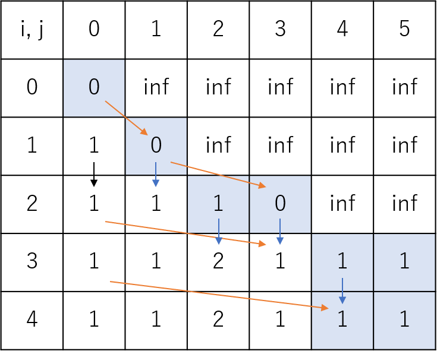

:author: nodashin
:date: 2023/04/20

###################
F - Erase Subarrays
###################

************************************************************
`問題 <https://atcoder.jp/contests/abc275/tasks/abc275_f>`__
************************************************************

.. raw:: html

   

   
問題ページを開きます。

    
   <iframe src="https://atcoder.jp/contests/abc275/tasks/abc275_f" height="600" width="100%">
   問題リンク
   </iframe>
    
   

****
解説
****

DPです。

.. math::

    dp[i][j][k] = a_{i} までみたとき a_{i} を使用して(k=0)/しない(k=1)で和が j になる最小の操作数

というDPが，浮かべばよいのですが，PyPyでその通り実装するとTLEになりました（ `提出 <https://atcoder.jp/contests/abc275/submissions/40775645>`__ ）。

そのため，少しだけ工夫して :math:`dp[i][j]` に収めます。
:math:`a_{i}` を使用するしないのためにDPの次元を一つ増やすのではなく，別途 ``set`` で管理します。

入力例1のDP Table は下のようになります。
マスの色は

- 青枠マス: :math:`a_{i}` を使用している
- 無色マス: :math:`a_{i}` を使用しない
  
を表しています。青枠から無色（:math:`a_{i}` を使用しない）への遷移時に操作回数は :math:`+1` されます。
ここでネックになるのが，:math:`a_{i}` を使用するときと使用しないときの値が同じになるときです。
:math:`a_{i}` より後続の数列もまとめて消去できる可能性が残っている「使用しない」ときの方が，
「使用する」ときの上位互換にあたるため，「使用しない」を優先します。

答えは最終行の :math:`1 \leq j` の範囲になります。

******
コード
******

提出コードは `こちら <https://atcoder.jp/contests/abc275/submissions/40791481>`__ から。

``used`` という変数が，直前の行の操作時に :math:`j` を使用したかどうかを意味します。

.. code:: python

    INF = 1<<30
    N, M = map(int, input().split())
    aa = list(map(int, input().split()))
    dp = [[INF] * (M+1) for _ in range(N+1)]
    dp[0][0] = 0
    used = set([0])
    for i, ai in enumerate(aa, start=1):
        _used = set([])
        for j in range(M+1):
            dp[i][j] = min(dp[i][j], dp[i-1][j] + (j in used))
        for j in range(M+1-ai):
            if dp[i-1][j] < dp[i][j+ai]:
                dp[i][j+ai] = dp[i-1][j]
                _used.add(j+ai)
        used = _used
    ans = [-1 if v == INF else v for v in dp[-1][1:]]
    print(*ans, sep='\n')